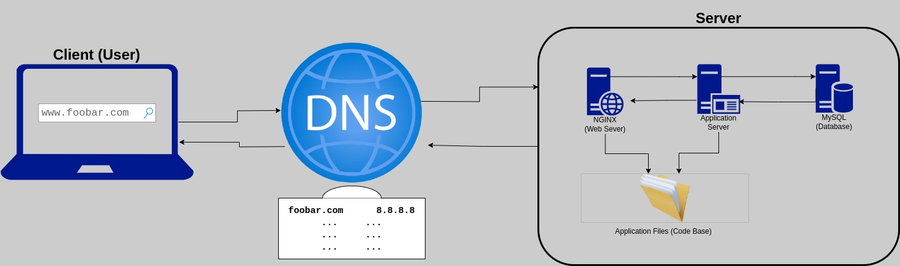

### Simple Web Stack Infrastructure.

1. A user wants to access the website by typing `www.foobar.com` into their web browser.
2. The user's computer sends a DNS query to resolve the domain name `www.foobar.com` to an IP address.
3. The DNS server returns the IP address `8.8.8.8`, which is the IP address of the server hosting the website.
4. The user's computer sends an HTTP request to the server at IP address `8.8.8.8`.
5. The server receives the request and passes it to the web server, Nginx, which is responsible for handling incoming HTTP requests.
6. Nginx forwards the request to the application server, which processes the request and generates a response.
7. The application server may need to retrieve data from the MySQL database to generate the response.
8. Once the response is generated, it is sent back to Nginx, which sends it back to the user's computer.
9. The user's web browser receives the response and displays the website.

---

### Now, let me explain some specifics about this infrastructure:
- A **server** is a computer or program that provides a service to other computers or programs, known as clients, over a network.
- The **domain name** is used to identify and locate a website on the Internet. It is easier for users to remember a domain name like `www.foobar.com` than an IP address like `8.8.8.8`.
- The `www` in `www.foobar.com` is a type of DNS record known as a CNAME (Canonical Name) record, which is used to map one domain name to another.
- The **web server** (Nginx) is responsible for handling incoming HTTP requests from clients and serving static content such as HTML, CSS, and JavaScript files.
- The **application server** is responsible for running the application code and generating dynamic content based on user requests.
- The **database** (MySQL) is used to store and retrieve data needed by the application.
- The server communicates with the user's computer using the HTTP protocol.

There are several issues with this infrastructure:
- It has a **Single Point of Failure (SPOF)**: if any component of the system fails (e.g., the server, Nginx, application server, or database), the entire website will be unavailable.
- There will be **downtime when maintenance is needed**: for example, if new code needs to be deployed or if Nginx needs to be restarted, the website will be unavailable during that time.
- It **cannot scale** if there is too much incoming traffic: if too many users try to access the website at once, it may become slow or unresponsive.
