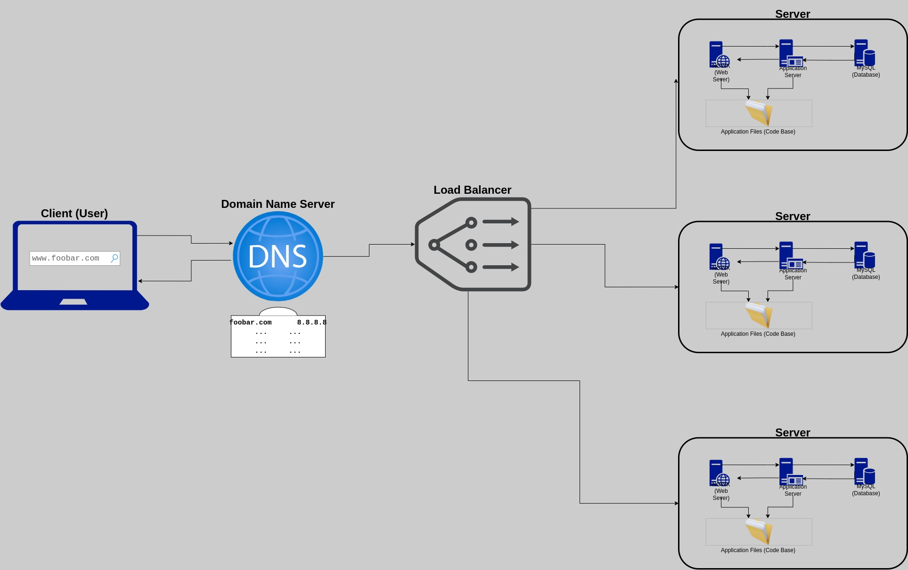

### Distributed Web Infrastructure

1. A user wants to access the website by typing `www.foobar.com` into their web browser.
2. The user's computer sends a DNS query to resolve the domain name `www.foobar.com` to an IP address.
3. The DNS server returns the IP address of the load balancer, HAproxy, which is responsible for distributing incoming traffic to the web servers.
4. The user's computer sends an HTTP request to the load balancer.
5. The load balancer receives the request and forwards it to one of the web servers, Nginx, using a configured distribution algorithm.
6. Nginx receives the request and passes it to the application server, which processes the request and generates a response.
7. The application server may need to retrieve data from the MySQL database to generate the response. The database is set up as a Primary-Replica (Master-Slave) cluster, with one Primary node and one or more Replica nodes.
8. Once the response is generated, it is sent back to Nginx, which sends it back to the load balancer.
9. The load balancer sends the response back to the user's computer.
10. The user's web browser receives the response and displays the website.

Now, let me explain some specifics about this infrastructure:
- We are adding **two additional servers** to increase redundancy and reduce the risk of a Single Point of Failure (SPOF).
- We are adding a **load balancer** (HAproxy) to distribute incoming traffic across multiple web servers, improving performance and reducing downtime.
- The **distribution algorithm** used by the load balancer can vary depending on the specific needs of the system. Some common algorithms include round-robin, least connections, and IP hash.
- The load balancer can be configured in either an **Active-Active** or **Active-Passive** setup. In an Active-Active setup, all servers are actively processing requests at all times. In an Active-Passive setup, one server is designated as the primary server and handles all requests until it fails, at which point a secondary server takes over.
- A **database Primary-Replica (Master-Slave) cluster** works by having one Primary node that handles all write operations and one or more Replica nodes that handle read operations. The Primary node replicates its data to the Replica nodes in real-time to ensure data consistency.
- In regard to the application, the **Primary node** is responsible for handling all write operations while the **Replica nodes** handle read operations.

There are several issues with this infrastructure:
- There are still potential **Single Points of Failure (SPOF)**: if any component of the system fails (e.g., the load balancer or database), the entire website may be unavailable.
- There may be **security issues** if no firewall or HTTPS is used.
- There is **no monitoring** in place to detect and respond to issues.
