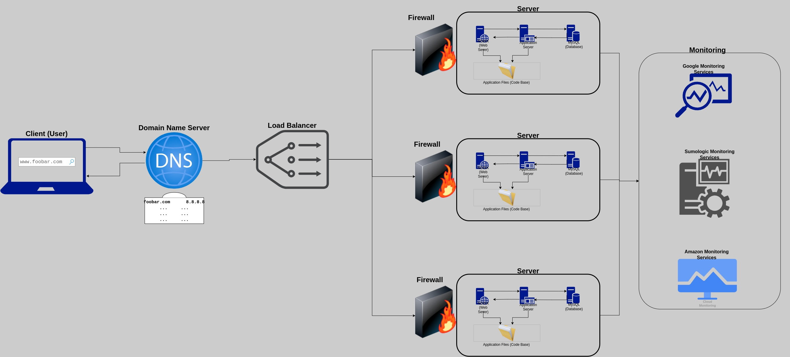

### Secured and Monitored Web Infrastructure

1. A user wants to access the website by typing `https://www.foobar.com` into their web browser.
2. The user's computer sends a DNS query to resolve the domain name `www.foobar.com` to an IP address.
3. The DNS server returns the IP address of the load balancer, which is responsible for distributing incoming traffic to the web servers.
4. The user's computer sends an HTTPS request to the load balancer.
5. The load balancer receives the request and terminates the SSL connection using an SSL certificate for `www.foobar.com`.
6. The load balancer forwards the decrypted request to one of the web servers, Nginx, using a configured distribution algorithm.
7. Nginx receives the request and passes it through a firewall, which filters incoming traffic based on predefined rules.
8. Nginx passes the request to the application server, which processes the request and generates a response.
9. The application server may need to retrieve data from the MySQL database to generate the response. The database is set up as a Primary-Replica (Master-Slave) cluster, with one Primary node and one or more Replica nodes.
10. Once the response is generated, it is sent back to Nginx, which sends it back to the load balancer.
11. The load balancer encrypts the response using the SSL certificate for `www.foobar.com` and sends it back to the user's computer.
12. The user's web browser receives the encrypted response and decrypts it using the SSL certificate for `www.foobar.com`.
13. The user's web browser displays the website.

Now, let me explain some specifics about this infrastructure:
- We are adding **three firewalls** to improve security by filtering incoming traffic based on predefined rules.
- We are using an **SSL certificate** to serve traffic over HTTPS, which encrypts data in transit between the user's computer and the server.
- We are adding **three monitoring clients** (data collectors for Sumologic or other monitoring services) to monitor various aspects of system performance and detect issues in real-time.

Some specifics about these additional elements:
- **Firewalls** are used to control incoming and outgoing network traffic based on predefined rules. They can help to protect against unauthorized access and other security threats.
- Serving traffic over **HTTPS** helps to protect against interception and tampering of data in transit by encrypting it using SSL/TLS.
- **Monitoring** is used to collect data on various aspects of system performance, such as CPU usage, memory usage, network traffic, and more. This data can be used to detect issues in real-time and respond accordingly.

There are several issues with this infrastructure:
- Terminating SSL at the load balancer level can be an issue because it means that data is decrypted before being forwarded to the web servers, potentially exposing it to interception or tampering.
- Having only one MySQL server capable of accepting writes can be an issue because it creates a Single Point of Failure (SPOF) for write operations.
- Having servers with all the same components (database, web server, and application server) can be a problem because it increases complexity and makes it more difficult to scale individual components as needed.
