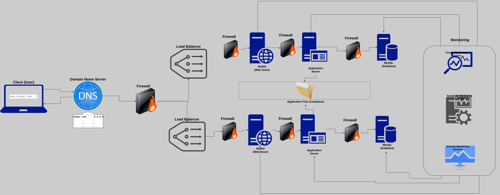

### Scale Up

1. We are adding **1 additional server** to increase redundancy and reduce the risk of a Single Point of Failure (SPOF).
2. We are adding a **load balancer** (HAproxy) configured as a cluster with the other one to distribute incoming traffic across multiple web servers, improving performance and reducing downtime.
3. We are **splitting the components** (web server, application server, database) onto their own servers to improve scalability and make it easier to manage and maintain each component.

### Some specifics about these additional elements:
- Adding an **additional server** increases redundancy by providing a backup in case one server fails.
- Adding a **load balancer** (HAproxy) improves performance by distributing incoming traffic across multiple web servers and reducing downtime by providing failover in case one server fails.
- **Splitting the components** onto their own servers improves scalability by allowing each component to be scaled independently as needed. It also makes it easier to manage and maintain each component by separating concerns.
